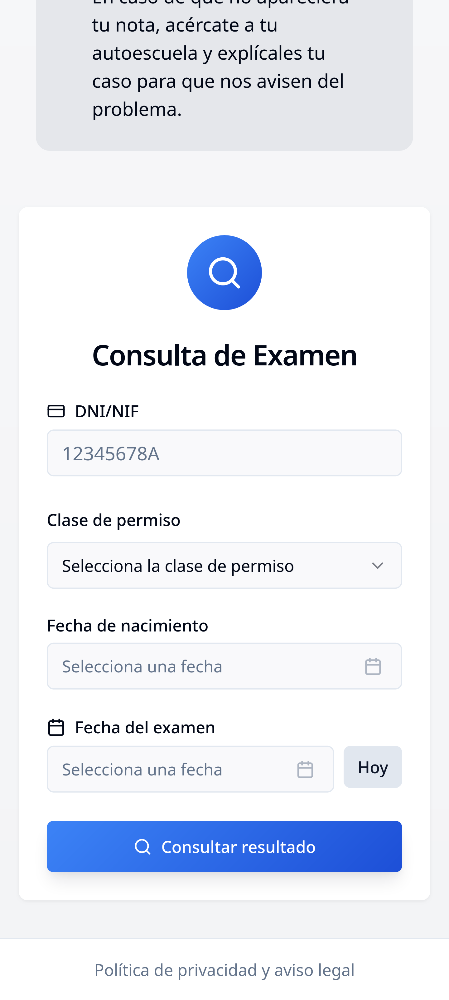
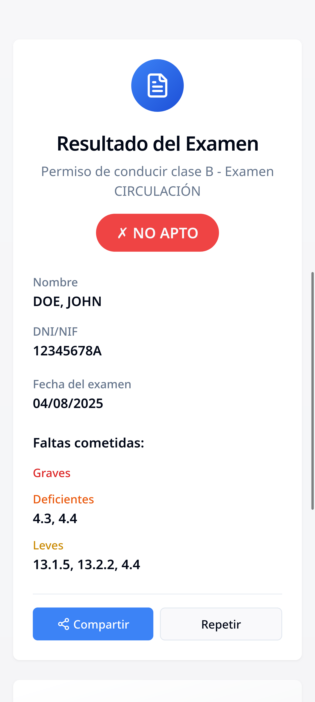
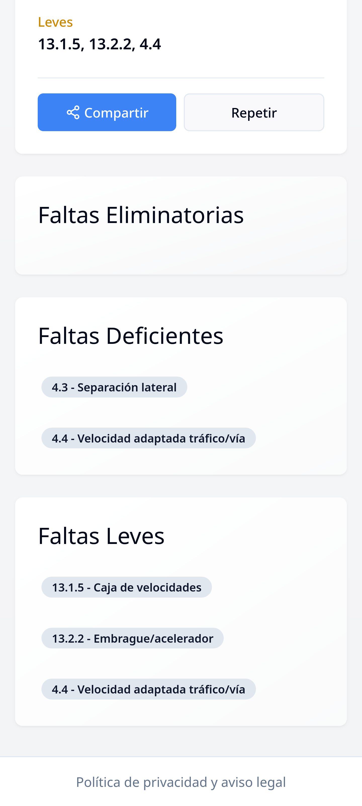

|  |  |  |
| --- | --- | --- |


<p align="center">
<b>Mi Nota DGT</b>
<br />
Consulta tus notas de examenes de conducir
</p>

Aplicación web para consultar las notas de exámenes de la DGT (Dirección General de Tráfico) de España.

## 🚀 Cómo ejecutar

### Opción 1: Ejecutar todo automáticamente
```bash
npm run dev:full
```

Este comando ejecutará tanto el servidor backend como el frontend simultáneamente.

### Opción 2: Ejecutar por separado

1. **Servidor backend** (en una terminal):
```bash
npm run server
```

2. **Frontend** (en otra terminal):
```bash
npm run dev
```

## 📋 Requisitos

- Node.js 18+
- npm o bun

## 🛠️ Instalación

```bash
npm install
```

## 🔧 Scripts disponibles

- `npm run dev` - Inicia el servidor de desarrollo del frontend
- `npm run server` - Inicia el servidor backend (proxy para DGT)
- `npm run dev:full` - Inicia ambos servidores simultáneamente
- `npm run build` - Construye la aplicación para producción
- `npm run lint` - Ejecuta el linter

## 🌐 Acceso

Una vez ejecutados los servidores:
- Frontend: http://localhost:8081
- Backend API: http://localhost:3001

## ⚠️ Solución CORS

Esta aplicación incluye un servidor backend que actúa como proxy para evitar problemas de CORS al hacer peticiones a la API de la DGT.
